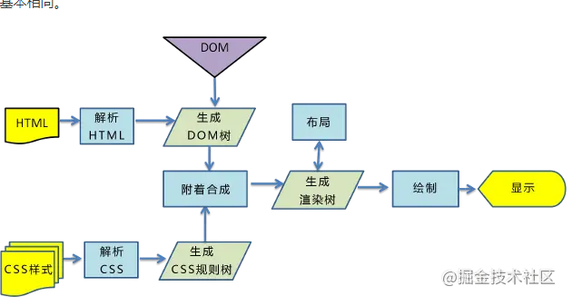

##### 1.vue中watch和computed有什么不同。

computed：是依赖于其他属性值，当我有一个值依赖于另一个值发生变化而变化时就可以设计为computed。并且computed的值是有缓存，当依赖的值变化时，并在下一次获取computed的值时才会重新计算。（不支持异步的操作）

**应用场景：**当该数据紧依赖其他数据发生变化，需要经过复杂计算得到，用computed 。

watch：更多的是对一个值的监听，当值的变化时可能会作出某一些行为时，我们就应该去采用watch。（支持异步的操作）

watch函数有两个参数：

​        immediate：组件加载立即触发回调函数执行，
　　deep: 深度监听，为了发现对象内部值的变化，复杂类型的数据时使用，例如数组中的对象内容的改变。		   （push、pop、shift、unshift、splice、sort、reverse）

**应用场景：**该数据属于被依赖的，需要被监听自身的变化时对其它数据做一些操作；计算属性是自动监听依赖值的变化，从而动态返回内容。watch是一个过程，在监听的值变化时，可以触发一个回调，并做一些事情。

2. ##### js中的事件循环

   因为js代码整体是同步进行非阻塞的，当从下到下执行过程中，遇到异步事件时，js并不会等待处理完这个异步事件，而是将这个事件挂起，js又会根据异步事件的不同进行区分为宏任务和微任务。加入任务队列，继续向下执行。当同步代码执行完之后，会去任务队列里面看，优先取出微任务进行执行，当所有微任务队列执行完成后，去看宏任务队列中是否有任务，如果有则取出执行，当执行宏任务中出现微任务又加入到微任务队列，之后在清空微任务，后在取出宏任务。如此循环知道所有事件执行完毕。

   宏任务：setTnterval()  setTimeout()

   微任务： new Promise（）

3. ##### DOM的解析

   

,4. ##### 阻塞DOM的解析

   script 会组件dom 的解析

5. ##### 将link放在末尾会出现什么问题。
  会出现样式从无到有的过程.样式突然变化的情况，会给用户造成很不好的体验。link 不会阻塞dom的解析但是会阻碍dom 的渲染。

6. ##### css的解析顺序

   div p {font-size:15px} // 因为css的解析是从右向左，回优先找出所有的p标签判断父类是否为div  不建议此类操作。 尽量使用class 和id

   例如一棵树 从叶子节点到树节点 比从树节点到叶子节点更容易确定。